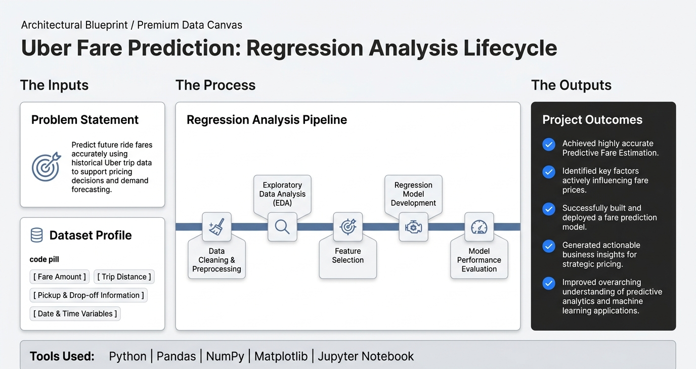

# Uber Fare Prediction Using Regression Analysis

## Overview

This project focuses on predicting future ride fares using regression analysis and machine learning techniques. The objective is to identify key factors affecting ride prices and build a predictive model capable of estimating fare amounts accurately.

## Project Objectives

* Analyze ride fare data and identify important pricing variables.
* Perform data cleaning and preprocessing.
* Apply regression analysis techniques for fare prediction.
* Evaluate model performance and forecasting accuracy.
* Generate insights through data visualization.

## Skills Demonstrated

* Data Cleaning & Preprocessing
* Exploratory Data Analysis (EDA)
* Regression Analysis
* Predictive Modeling
* Data Visualization
* Statistical Analysis

## Tools & Technologies

* Python
* Pandas
* NumPy
* Matplotlib
* Jupyter Notebook

## Key Activities

* Processed and cleaned raw ride fare data.
* Conducted exploratory data analysis to identify trends and relationships.
* Applied regression models to estimate future ride fares.
* Evaluated model performance using statistical metrics.
* Created visualizations to communicate analytical findings.

## Learning Outcomes

This project enhanced my understanding of predictive analytics, machine learning fundamentals, regression modeling, and data-driven decision-making in the transportation and mobility sector.

## Repository Structure

```text
├── Final uber vyaan.pdf
├── Jupyter Notebooks
├── Data Analysis Files
└── README.md
```

## Author

**Vyaan Dennu**

MBA (Finance) | Data Analytics | FinTech | Forensic Accounting & Fraud Investigation (FAFI)

LinkedIn: [www.linkedin.com/in/vyaan-dennu-644714290](http://www.linkedin.com/in/vyaan-dennu-644714290)
